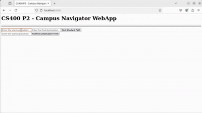

<div id="top">

<!-- HEADER STYLE: CLASSIC -->
<div align="center">


# UW-MADISON-SP-25-CAMPUS-MAP-DIRECTORY

<em>Navigate Smarter, Reach Further, Innovate Faster</em>

<!-- BADGES -->


<em>Built with the tools and technologies:</em>


</div>
<br>

---

## Table of Contents

- [Overview](#overview)
- [Getting Started](#getting-started)
    - [Prerequisites](#prerequisites)
    - [Installation](#installation)
    - [Usage](#usage)
    - [Testing](#testing)

---

## Overview

UW-Madison-SP-25-Campus-Map-Directory is a versatile developer toolset designed for campus navigation and spatial analysis. It combines efficient graph algorithms, robust data structures, and a web-based interface to enable dynamic route planning and location-based services.
  
**Why UW-Madison-SP-25-Campus-Map-Directory?**

This project streamlines the development of campus mapping applications with features including:

- 🧩 **Graph Management:** Efficiently load, analyze, and traverse campus location graphs for optimal routing.
- 🚦 **Pathfinding Algorithms:** Implement Dijkstra's algorithm to compute shortest paths and identify the furthest destinations.
- 🌐 **Web Integration:** Dynamic web content delivery and user interaction through a lightweight HTTP server and HTML templates.
- 🔍 **Data Structure Reliability:** Robust hash tables and maps with automated testing to ensure data integrity.
- 🛠️ **Development Support:** Placeholder components and organized branch setup facilitate testing and incremental development.

---

## 🎥 Demo Preview



> 🔗 [Watch full demo video on MediaSpace (1 min)](https://mediaspace.wisc.edu/media/CS400%20P2%20Demo/1_dvsuxgn2)

---

## Getting Started

### Prerequisites

This project requires the following dependencies:

- **Programming Language:** Java
- **Package Manager:** Maven

### Installation

Build UW-Madison-SP-25-Campus-Map-Directory from the source and install dependencies:

1. **Clone the repository:**

    ```sh
    ❯ git clone https://github.com/JatUppal/UW-Madison-SP-25-Campus-Map-Directory
    ```

2. **Navigate to the project directory:**

    ```sh
    ❯ cd UW-Madison-SP-25-Campus-Map-Directory
    ```

3. **Install the dependencies:**

**Using [maven](https://maven.apache.org/):**

```sh
❯ mvn install
```
**Using [maven](https://maven.apache.org/):**

```sh
❯ mvn install
```

### Usage

Run the project with:

**Using [maven](https://maven.apache.org/):**

```sh
mvn exec:java
```
**Using [maven](https://maven.apache.org/):**

```sh
mvn exec:java
```

### Testing

Uw-madison-sp-25-campus-map-directory uses the {__test_framework__} test framework. Run the test suite with:

**Using [maven](https://maven.apache.org/):**

```sh
mvn test
```
**Using [maven](https://maven.apache.org/):**

```sh
mvn test
```

---

<div align="left"><a href="#top">⬆ Return</a></div>

---
